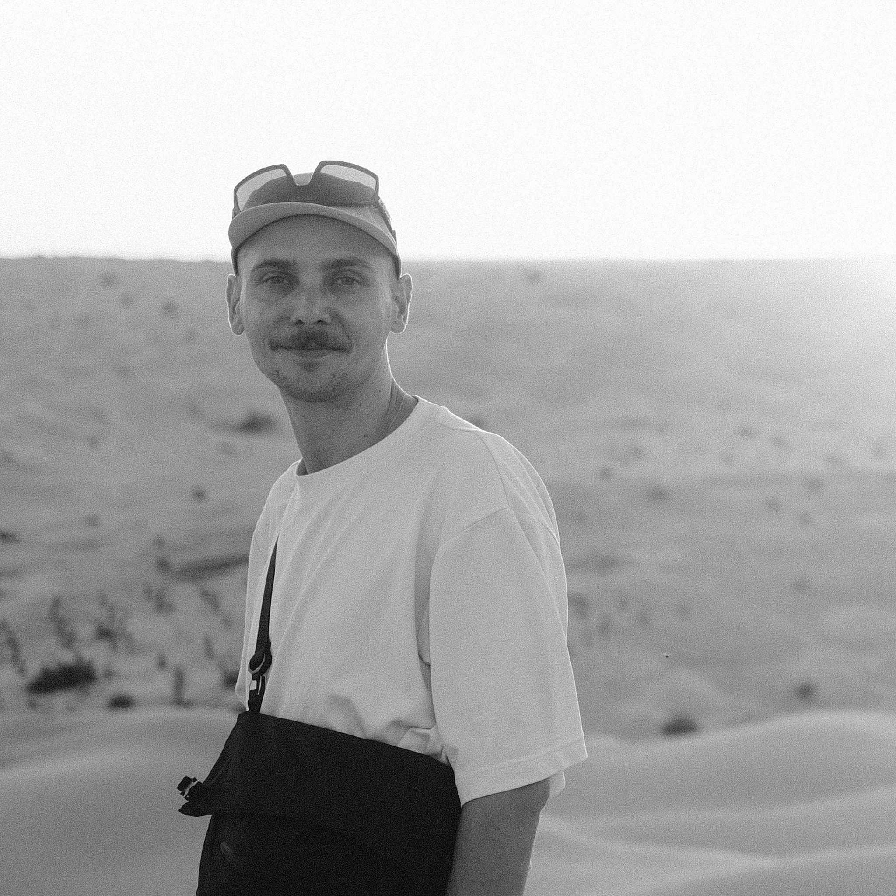

# About

  

    
  

  

    
I'm a research scientist at the [Chair of Aerodynamics and Fluid Mechanics (AER)](https://www.epc.ed.tum.de/aer/startseite/) at the Technical University of Munich (TUM). My work centers on the development, implementation, and validation of mesh-free hydrodynamics for engineering applications.

    
My research interests include advancing next-generation computational fluid dynamics (CFD) through exascale parallelism using shared- and distributed-memory acceleration, hardware-agnostic portable programming models, and automatic differentiation for gradient-based optimization. I aim to develop scalable, high-performance simulation frameworks that enable more efficient, accurate predictions in science and engineering.

    
<a href="mailto:fabian.fritz@tum.de">email</a> <a href="https://scholar.google.com/citations?user=vAXcR18AAAAJ&hl=en" target="_blank" rel="noopener">scholar</a> <a href="https://github.com/fritzio" target="_blank" rel="noopener">github</a> <a href="https://www.linkedin.com/in/fabian-fritz-cfd/" target="_blank" rel="noopener">linkedin</a>

  

