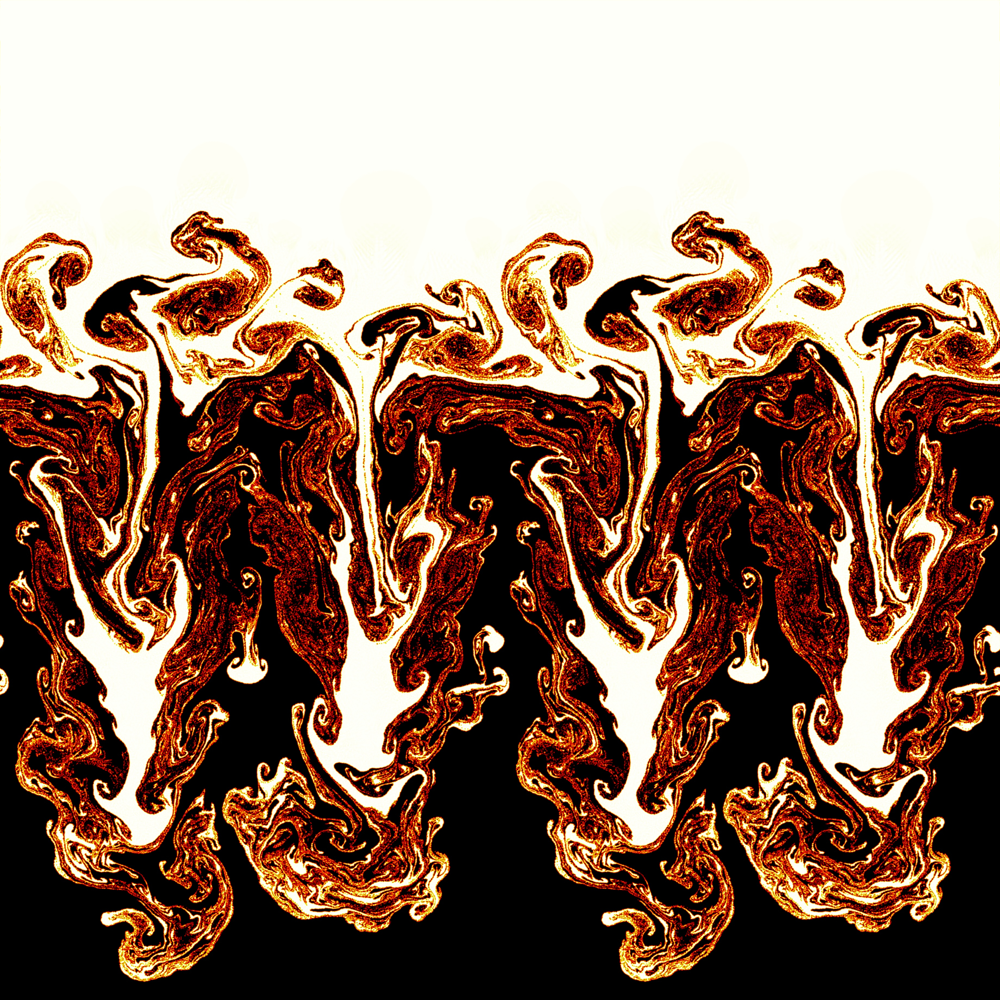

# Gallery

A collection of CFD simulation results, flow visualizations, and animations from my research and projects. Click any image or video to view it full-size.

    
    
Kelvin-Helmholtz instability

    
    
Rayleigh-Taylor instability

